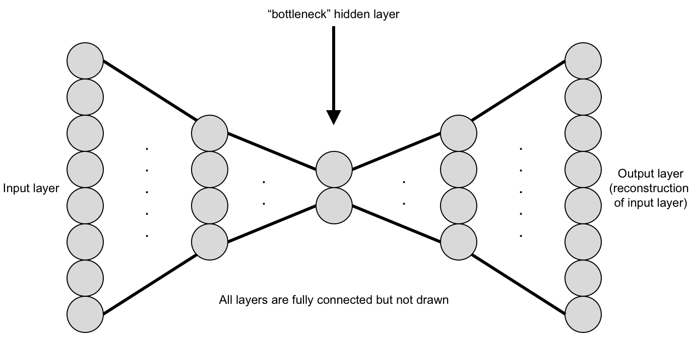

# COMP3710 Report Code
## Introduction
This project aims to implement a vision model to classify brain MRI data from the Alzheimer's Disease Neuroimaging Initiative (ADNI), and categorise them as either having Alzheimer's Disease (AD) or Normal Cognitive functions (NC).

In this git repository, I hope to demonstrate a vision model that can classify Alzheimer's disease (normal and AD) of the ADNI brain data with an accuracy of 0.8. The vision model implemented to achieve this task is the ConvNeXt model.

## Background information
### What is a ConvNeXt model?
A ConvNeXt model is a convolution model that has been modified by including the architecture of Vision Transformers (ViTs). Before the inception of the ConvNeXt model, ViTs outperformed convolution models in all computer vision tasks. However, in exchange for this improved performance, the transformers were computationally expensive and required large data sets for valid training. The idea of the ConvNeXt model was to create a convolution model that could perform as well or better than ViTs, while also retaining the efficiency and inductive biases of traditional convolution models, achieving the best of both worlds.

### What problem does this solve?
In the context of this problem, identifying Alzheimer’s disease and other medical datasets, models like ConvNeXt are significant as:
1. Medical datasets tend to be small and domain-specific, which means that ViTs may not be able to train with the amount of available data, and traditional convolution models may not be accurate/precise enough for practical use
2. Models must be efficient, stable and interpretable.

ConvNeXt models provide the transformer-level accuracy needed for subtle pattern detection like brain images or medical use, without requiring massive data or compute.

### How are ConvNeXt models made?
As mentioned in the What is a ConvNeXt model section, this model began by creating a ResNet model, a CNN architecture, as the base/starting point of the ConvNeXt model. This entailed creating a ConvNormAct() and BottleNeck() class. The ConvNormAct() is the standard building block in many CNN models. The BottleNeck() class acts as a channel expansion and compression mechanism that enables efficient feature transformation while maintaining computational efficiency. 

For the ConvNeXt model, the BottleNeck() class is inverted, so instead of the regular structure as seen in the image below:

The BottleNeck() goes from narrow->wide->narrow; this change in design makes it so that less information is lost in early layers, as the input information is not being compressed down which may result in the information being lost. It also allows for better Gradient Flow, which reduces gradient vanishing in deep networks and usually makes the training more stable and follows the general architecture of a ViT's Multi-Layer perceptron. 

Next, the model will call upon the ConvNextEncoder() class that processes input through multiple stages. The encoder of this model consists of a stem followed by a series of stages that progressively extract features at different spatial resolutions and channel dimensions. These stages can be found in the module.py file as ConvNextStage() and ConvNextStem() classes. The ConvNextStage() class is called, which consists of multiple inverted bottleneck blocks, which typically reduce the spatial dimensions by a factor of 2 and increase the channel dimensions. The first layer that the model will interact with will be modified with the ConvNextStem() class, which performs a heavy downsampling; the job of the  stem segment/first layer is to process the input image and perform aggressive spatial reduction while expanding channels.

Finally, the ClassificationHead() class for ConvNeXt that produces final class predictions, this head performs global average pooling, normalisation, dropout, and final linear projection to the number of classes. The ClassificationHead() and the ConvNextEncoder() are combined together by the ConvNextForImageClassification() class; This model combines the ConvNeXt encoder with a classification head to form a complete image classification pipeline.

## Dependencies, Requirements and Preprocessing:
### Dependencies and Requirements
These are the Libraries/packages that are required to run the files:

torch>=1.13.0

torchvision>=0.14.0

numpy>=1.21.0

scikit-learn>=1.0.0

matplotlib>=3.5.0

Pillow>=9.0.0

To install all libraries/packages/dependencies, input the following command into a terminal of sorts, either command prompt, VSCode's terminal or your own choice:

```
pip install torch torchvision numpy matplotlib scikit-learn
```
### Preprocessing
The only preprocessing that occurs is in the train transform, which can be found in the dataset.py file.
```
# Training transformations with data augmentation
        self.train_transform = transforms.Compose([
            transforms.Grayscale(num_output_channels=1),
            transforms.Resize((224, 224)),
            transforms.RandomHorizontalFlip(p=0.5),
            transforms.RandomRotation(degrees=10),
            transforms.RandomAffine(degrees=0, translate=(0.05, 0.05)),
            transforms.ColorJitter(brightness=0.2, contrast=0.2),
            transforms.ToTensor(),
            transforms.Lambda(lambda x: x.repeat(3, 1, 1)), 
            transforms.Normalize(mean=[0.485, 0.456, 0.406],
                            std=[0.229, 0.224, 0.225])
    ])
```
The augmentation of the training helps the model to be more stable by increasing dataset diversity and improving model generalisation. This is achieved as the augmentation reduces overfitting on small medical datasets and helps the model learn more robust feature representations. This augmentation is not done on the test set as it is purely there to test the accuracy of the models' learning, and thus, augmenting the images will have no real impact on the models' betterment.

## Data Split
The split of the data is as follows:

Training: 80%

Validation: 20%

Testing: 100%

### Justification of Data Split
This split strategy ensures sufficient training data for convergence while maintaining adequate samples for reliable validation. Since the testing data was in its own file, separate to the training images, it was not necessary to split and could test using the full file with no drawbacks.

## Example inputs and outputs
An example input and output you might expect would be:
example input:
```
input_tensor = torch.randn(1, 3, 224, 224)
```
example output:
```
{
    'prediction': 'AD',  # or 'Normal'
    'confidence': 0.87,
    'probabilities': {
        'Normal': 0.13,
        'AD': 0.87
    }
}
```

## Results
Our final epoch in the train file gives the following output.
```
Epoch [300/300], Training Loss: 0.1893
Training took 0.6 minutes
Epoch [300/300], Validation Loss: 0.5839, Validation Accuracy: 0.7849
```
This looks good as the training loss is 
 Test Accuracy: 0.6308

Confusion Matrix:
[[2110 2350]
 [ 973 3567]]

Classification Report:
              precision    recall  f1-score   support

      Normal       0.68      0.47      0.56      4460
          AD       0.60      0.79      0.68      4540

    accuracy                           0.63      9000

## Plots and Figures

## Justification

